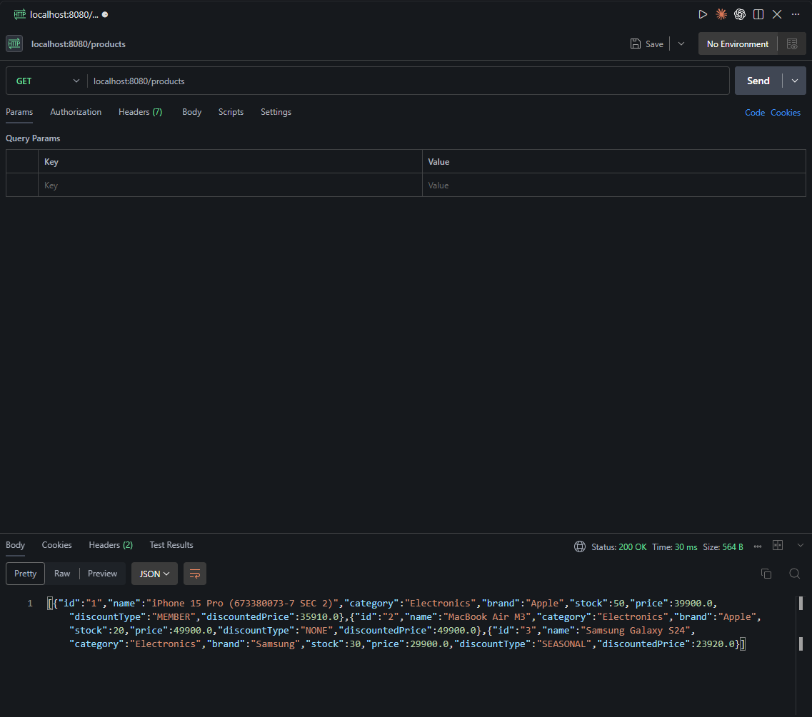
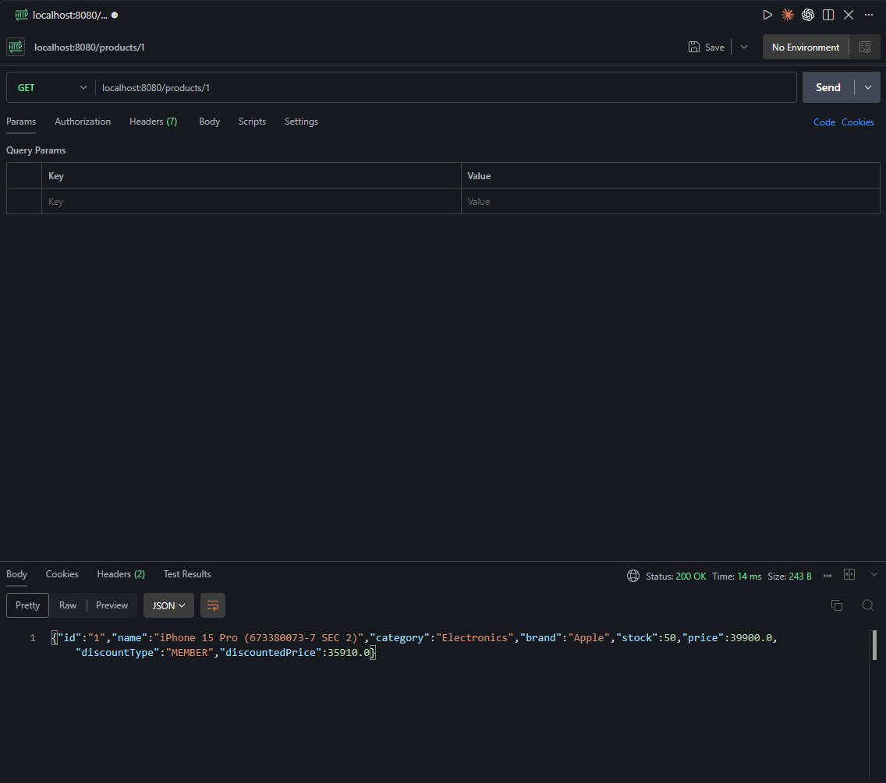
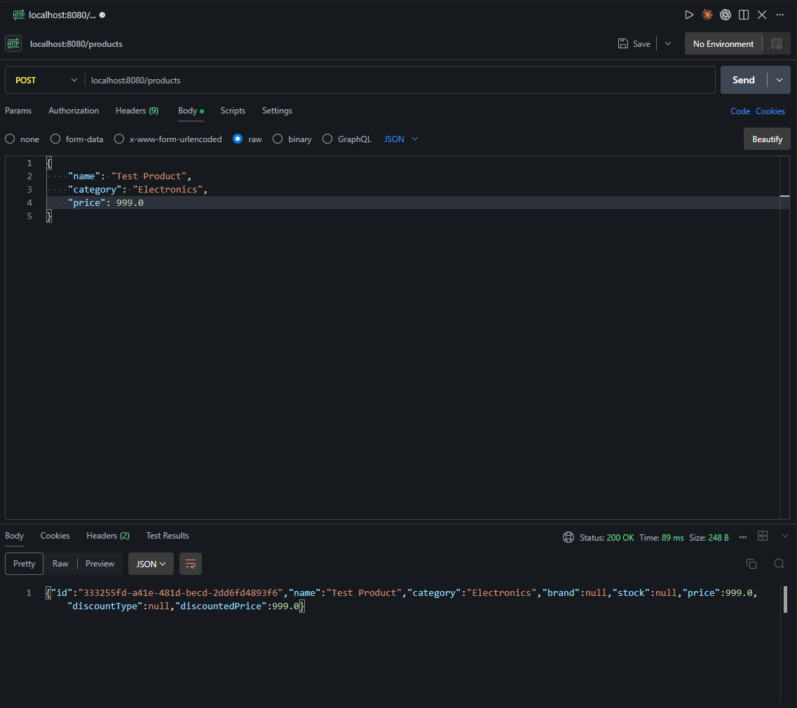
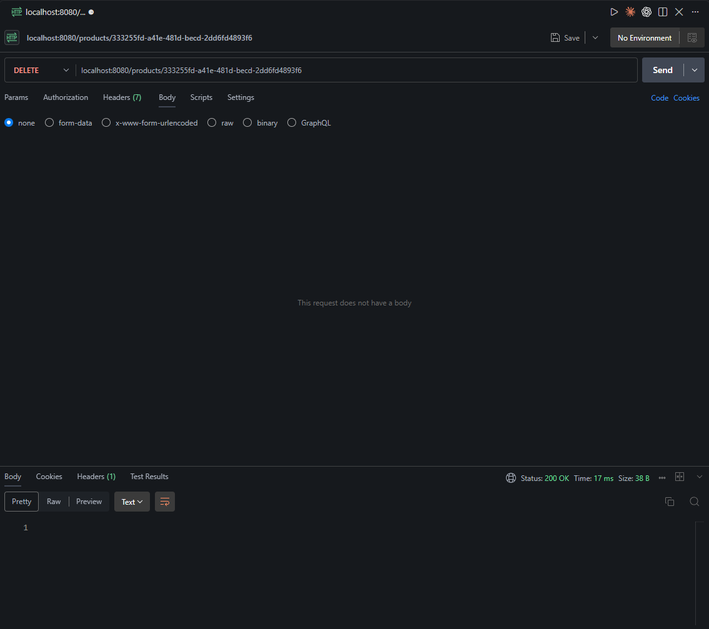
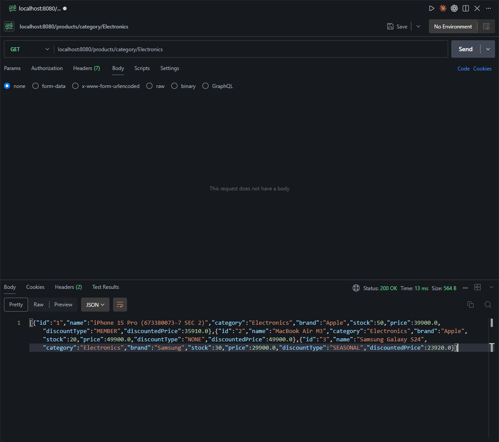
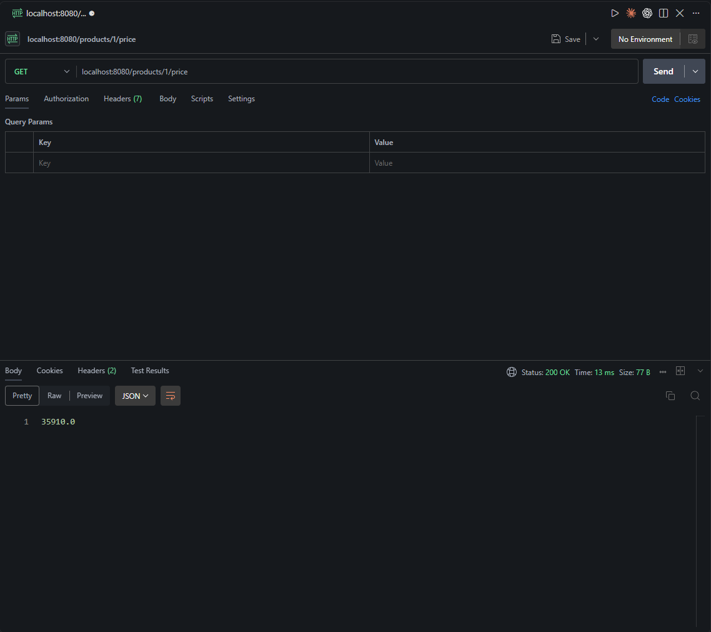

# Lab 10 Report: Spring WebFlux & WebClient

**ชื่อ:** เพชรภิญโญ ธนศิรินรากร  
**รหัสนักศึกษา:** 673380073-7  
**Section:** 2  
**วิชา:** CP353002 หลักการออกแบบและพัฒนาซอฟต์แวร์

---

## 1. Reactive Programming vs Blocking I/O

### Blocking I/O (แบบดั้งเดิม)

Blocking I/O คือการเขียนโปรแกรมที่ **thread จะรอจนกว่าจะได้ผลลัพธ์** ก่อนจึงจะทำงานอื่นต่อ

**ตัวอย่างการทำงาน:**

```
Thread 1: ทำ HTTP request → รอ response (blocked) → ได้ผลแล้วจึงทำต่อ
Thread 2: อ่านไฟล์ → รอจนอ่านเสร็จ (blocked) → ทำต่อ
```

**ปัญหา:**

- หนึ่ง request = หนึ่ง thread → ถ้ามี 1,000 requests = ต้องมี 1,000 threads
- Thread มีค่าใช้จ่ายสูง (memory, context switching)
- ไม่เหมาะกับระบบที่มี concurrent requests สูง

---

### Reactive Programming

Reactive Programming คือการเขียนโปรแกรมแบบ **asynchronous** ที่ **thread ไม่รอ** แต่จะไปทำงานอื่นต่อ และกลับมาประมวลผลเมื่อข้อมูลพร้อม

**ตัวอย่างการทำงาน:**

```
Thread 1: ส่ง HTTP request → ไปทำงานอื่นต่อ → callback เมื่อได้ response
Thread 1: อ่านไฟล์ → ไปทำงานอื่นต่อ → callback เมื่ออ่านเสร็จ
```

**ข้อดี:**

- จำนวน thread น้อย แต่รองรับ requests ได้เยอะ
- เหมาะกับ high-concurrency, streaming data, real-time applications
- ใช้ทรัพยากรระบบน้อยกว่า

---

### ตารางเปรียบเทียบ

| หัวข้อ           | Blocking I/O                  | Reactive Programming                   |
| ---------------- | ----------------------------- | -------------------------------------- |
| **Thread model** | 1 thread per request          | Few threads, many requests             |
| **การรอผล**      | Thread หยุดรอ                 | Thread ไม่หยุด ทำงานอื่นต่อ            |
| **Return type**  | `Product result`              | `Mono<Product>` / `Flux<Product>`      |
| **Scalability**  | จำกัดด้วยจำนวน threads        | รองรับ concurrent สูง                  |
| **Use case**     | CRUD ทั่วไป, small load       | High traffic, streaming, microservices |
| **Memory usage** | สูง (threads มีค่าใช้จ่ายมาก) | ต่ำ (thread pool เล็ก)                 |

---

### สรุป

**Reactive Programming** เหมาะกับระบบที่:

- มี concurrent requests สูง (เช่น e-commerce, social media)
- ต้องการ real-time streaming (chat, notifications)
- ต้องเรียก external APIs หลายตัวพร้อมกัน

**Blocking I/O** เหมาะกับระบบที่:

- Logic ไม่ซับซ้อน, request ไม่เยอะ
- ทีมยังไม่คุ้นเคยกับ Reactive Programming
- ไม่ต้องการ high concurrency

---

## 2. Mono vs Flux — ใช้กรณีไหน และทำไม

### Mono<T> — 0 หรือ 1 รายการ

`Mono<T>` เป็น **Publisher** ที่คืนค่า **0 หรือ 1 รายการ** เหมือนกับ `Optional<T>` ในโลก Reactive

**สร้าง Mono:**

```java
Mono<String> m1 = Mono.just("Hello");        // มีค่า
Mono<String> m2 = Mono.empty();              // ไม่มีค่า
Mono<Product> m3 = repository.findById("1"); // หาจาก DB
```

**Operators ที่ใช้บ่อย:**

```java
mono.map(p -> p.getName())                    // แปลงค่า (sync)
    .flatMap(id -> repository.findById(id))   // แปลงค่า (async)
    .defaultIfEmpty("Not Found")              // fallback ถ้าว่าง
    .switchIfEmpty(Mono.error(...))           // throw error ถ้าว่าง
    .subscribe(System.out::println);          // เริ่ม execute
```

**ใช้ Mono เมื่อ:**

- `findById(id)` → คืน 1 รายการหรือไม่มีเลย
- `save(product)` → บันทึกแล้วคืนผลลัพธ์ 1 รายการ
- `update(id, data)` → อัปเดตแล้วคืนผลลัพธ์ 1 รายการ
- `delete(id)` → ไม่คืนค่า → ใช้ `Mono<Void>`
- HTTP GET `/products/{id}` → คืน 1 Product

---

### Flux<T> — 0 ถึง N รายการ

`Flux<T>` เป็น **Publisher** ที่คืนค่า **0 ถึง N รายการ** เหมือนกับ `Stream<T>` ในโลก Reactive

**สร้าง Flux:**

```java
Flux<String> f1 = Flux.just("A", "B", "C");   // จากค่าตายตัว
Flux<Product> f2 = repository.findAll();       // หาจาก DB
Flux<Integer> f3 = Flux.range(1, 10);          // range 1-10
```

**Operators ที่ใช้บ่อย:**

```java
flux.map(p -> p.getName())                     // แปลงแต่ละ element
    .filter(name -> name.startsWith("A"))      // กรอง
    .flatMap(id -> repository.findById(id))    // async transform
    .take(5)                                   // เอาแค่ 5 ตัวแรก
    .collectList()                             // รวมเป็น Mono<List<T>>
    .subscribe(System.out::println);           // เริ่ม execute
```

**ใช้ Flux เมื่อ:**

- `findAll()` → คืนทุกรายการ
- `search(keyword)` → คืนหลายผลลัพธ์
- Streaming data → server-sent events, log streaming
- HTTP GET `/products` → คืนหลาย Products

---

### Rule of Thumb

| ผลลัพธ์ที่คืน                              | ใช้             |
| ------------------------------------------ | --------------- |
| **1 รายการ**                               | `Mono<Product>` |
| **หลายรายการ**                             | `Flux<Product>` |
| **ไม่มีผลลัพธ์** (side-effect เช่น delete) | `Mono<Void>`    |

---

### สรุป

เลือกใช้ `Mono` หรือ `Flux` ตาม **จำนวนผลลัพธ์ที่คาดหวัง**:

- ถ้าคืน **1 ค่า** → `Mono<T>`
- ถ้าคืน **หลายค่า** → `Flux<T>`
- ถ้า **ไม่คืนค่า** → `Mono<Void>`

---

## 3. WebClient — Method Chain Explanation

WebClient คือ **non-blocking HTTP client** ใน Spring WebFlux ที่ใช้เรียก REST API แบบ Reactive

### โครงสร้าง Method Chain

```java
WebClient client = WebClient.create("http://localhost:8080");

Mono<Product> result = client.get()              // 1. HTTP Method
    .uri("/products/{id}", "1")                  // 2. URI
    .retrieve()                                  // 3. Retrieve
    .bodyToMono(Product.class);                  // 4. Body Conversion
```

---

### 1. `.get()` / `.post()` / `.delete()` — HTTP Method

กำหนด HTTP method ที่จะใช้

```java
client.get()      // GET request
client.post()     // POST request
client.put()      // PUT request
client.delete()   // DELETE request
client.patch()    // PATCH request
```

---

### 2. `.uri()` — กำหนด URL

กำหนด endpoint ที่จะเรียก รองรับ path variables

```java
// แบบ static
.uri("/products")

// แบบมี path variable
.uri("/products/{id}", "1")

// แบบมีหลาย parameters
.uri("/products/{id}/reviews/{reviewId}", "1", "100")

// แบบ query parameters
.uri(uriBuilder -> uriBuilder
    .path("/products")
    .queryParam("category", "Electronics")
    .queryParam("minPrice", 1000)
    .build())
```

---

### 3. `.retrieve()` — เริ่มรับ Response

เริ่มทำ HTTP request และรับ response กลับมา

```java
.retrieve()  // รับ response แบบปกติ
```

**ทางเลือก:** `.exchange()` (สำหรับ low-level control)

---

### 4. `.bodyToMono()` / `.bodyToFlux()` — แปลง Body

แปลง response body เป็น `Mono<T>` หรือ `Flux<T>`

```java
// แปลงเป็น Mono (1 รายการ)
.bodyToMono(Product.class)
.bodyToMono(String.class)
.bodyToMono(Void.class)    // สำหรับ DELETE

// แปลงเป็น Flux (หลายรายการ)
.bodyToFlux(Product.class)
.bodyToFlux(String.class)
```

---

### ตัวอย่างแต่ละ HTTP Method

#### GET — ดึงข้อมูล 1 รายการ

```java
Mono<Product> product = client.get()
    .uri("/products/{id}", "1")
    .retrieve()
    .bodyToMono(Product.class);
```

#### GET — ดึงข้อมูลหลายรายการ

```java
Flux<Product> products = client.get()
    .uri("/products")
    .retrieve()
    .bodyToFlux(Product.class);
```

#### POST — ส่งข้อมูล

```java
Product newProduct = new Product();
newProduct.setName("iPhone 15");

Mono<Product> saved = client.post()
    .uri("/products")
    .bodyValue(newProduct)        // ส่ง body
    .retrieve()
    .bodyToMono(Product.class);
```

#### DELETE — ลบข้อมูล

```java
Mono<Void> result = client.delete()
    .uri("/products/{id}", "1")
    .retrieve()
    .bodyToMono(Void.class);
```

---

### Operators เพิ่มเติมที่ใช้ได้

```java
client.get()
    .uri("/products/{id}", "1")
    .retrieve()
    .bodyToMono(Product.class)
    .doOnNext(p -> System.out.println("Received: " + p))  // Log
    .map(p -> p.getName())                                 // Transform
    .defaultIfEmpty("Not Found")                           // Fallback
    .subscribe(System.out::println);                       // Execute
```

---

### สรุป Method Chain

| Method          | หน้าที่                     | ตัวอย่าง                         |
| --------------- | --------------------------- | -------------------------------- |
| `.get()`        | กำหนด HTTP method           | `.get()`, `.post()`, `.delete()` |
| `.uri()`        | กำหนด URL                   | `.uri("/products/{id}", "1")`    |
| `.bodyValue()`  | ส่ง request body (POST/PUT) | `.bodyValue(product)`            |
| `.retrieve()`   | เริ่มรับ response           | `.retrieve()`                    |
| `.bodyToMono()` | แปลงเป็น Mono (1 รายการ)    | `.bodyToMono(Product.class)`     |
| `.bodyToFlux()` | แปลงเป็น Flux (หลายรายการ)  | `.bodyToFlux(Product.class)`     |

---

## 4. Code Implementation พร้อม Comment

### 4.1 ProductRepository.java

```java
package com.example.lab10.repository;

import com.example.lab10.model.Product;
import reactor.core.publisher.Flux;
import reactor.core.publisher.Mono;

import java.util.Map;
import java.util.concurrent.ConcurrentHashMap;

/**
 * ProductRepository — In-memory Reactive Repository
 * ใช้ ConcurrentHashMap เก็บข้อมูลแทน Database
 */
public class ProductRepository {

    // ── In-memory storage ────────────────────────────────
    private final Map<String, Product> store = new ConcurrentHashMap<>();

    // ── Constructor: seed ข้อมูลตัวอย่าง ─────────────────
    public ProductRepository() {
        store.put("1", new Product("1", "iPhone 15 Pro (673380073-7 SEC 2)",
                "Electronics", "Apple", 50, 39900.0, "MEMBER"));
        store.put("2", new Product("2", "MacBook Air M3",
                "Electronics", "Apple", 20, 49900.0, "NONE"));
        store.put("3", new Product("3", "Samsung Galaxy S24",
                "Electronics", "Samsung", 30, 29900.0, "SEASONAL"));
    }

    /**
     * หา Product จาก id
     * @return Mono<Product> ถ้าพบ, Mono.empty() ถ้าไม่พบ
     */
    public Mono<Product> findById(String id) {
        Product product = store.get(id);  // ดึงจาก Map

        // ถ้าไม่พบคืน Mono.empty()
        if (product == null) {
            return Mono.empty();
        }

        // ถ้าพบห่อด้วย Mono.just()
        return Mono.just(product);
    }

    /**
     * ดึง Product ทั้งหมด
     * @return Flux<Product> ของทุกรายการ
     */
    public Flux<Product> findAll() {
        // แปลง Collection เป็น Flux
        return Flux.fromIterable(store.values());
    }

    /**
     * บันทึก Product
     * @return Mono<Product> ของรายการที่บันทึก
     */
    public Mono<Product> save(Product product) {
        // ใส่ลง Map
        store.put(product.getId(), product);

        // คืน Mono ของ Product ที่บันทึก
        return Mono.just(product);
    }

    /**
     * ลบ Product
     * @return Mono<Void> เพราะไม่มีข้อมูลคืนกลับ
     */
    public Mono<Void> deleteById(String id) {
        // ลบออกจาก Map
        store.remove(id);

        // คืน Mono.empty() เพราะเป็น side-effect
        return Mono.empty();
    }

    /**
     * หา Product ตาม category
     * @return Flux<Product> ที่ category ตรงกัน
     */
    public Flux<Product> findByCategory(String category) {
        // ดึงทั้งหมดแล้วกรอง
        return findAll()
            .filter(p -> p.getCategory().equalsIgnoreCase(category));
    }
}
```

---

### 4.2 ProductService.java

```java
package com.example.lab10.service;

import com.example.lab10.model.Product;
import com.example.lab10.repository.ProductRepository;
import org.springframework.stereotype.Service;
import reactor.core.publisher.Flux;
import reactor.core.publisher.Mono;

/**
 * ProductService — Business Logic Layer
 * SRP: มีหน้าที่จัดการ business logic เท่านั้น
 * DIP: Depend on Repository abstraction
 */
@Service
public class ProductService {

    // ── Constructor Injection (SOLID Principle) ──────────
    private final ProductRepository repository;

    public ProductService(ProductRepository repository) {
        this.repository = repository;
    }

    /**
     * ดึง Product 1 รายการ
     * @throws RuntimeException ถ้าไม่พบ
     */
    public Mono<Product> getById(String id) {
        return repository.findById(id)
            // ถ้าว่างให้ throw error
            .switchIfEmpty(
                Mono.error(new RuntimeException("Product not found: " + id))
            );
    }

    /**
     * ดึง Product ทั้งหมด
     */
    public Flux<Product> getAll() {
        return repository.findAll();
    }

    /**
     * บันทึก Product
     * Auto-generate ID ถ้ายังไม่มี
     */
    public Mono<Product> save(Product product) {
        // ตรวจสอบว่ามี id หรือยัง
        if (product.getId() == null || product.getId().isEmpty()) {
            // สร้าง UUID ใหม่
            product.setId(java.util.UUID.randomUUID().toString());
        }

        return repository.save(product);
    }

    /**
     * ลบ Product
     */
    public Mono<Void> delete(String id) {
        return repository.deleteById(id);
    }

    /**
     * หา Product ตาม category
     */
    public Flux<Product> getByCategory(String category) {
        return repository.findByCategory(category);
    }

    /**
     * คำนวณราคาหลังส่วนลด
     * ใช้ .map() เพราะเป็น sync transformation
     */
    public Mono<Double> getDiscountedPrice(String id) {
        return getById(id)
            // แปลง Product → Double
            .map(p -> p.getDiscountedPrice());
    }
}
```

---

### 4.3 ProductController.java

```java
package com.example.lab10.controller;

import com.example.lab10.model.Product;
import com.example.lab10.service.ProductService;
import org.springframework.web.bind.annotation.*;
import reactor.core.publisher.Flux;
import reactor.core.publisher.Mono;

/**
 * ProductController — Reactive REST Controller
 * SRP: มีหน้าที่รับ HTTP request และส่งต่อให้ Service
 */
@RestController
@RequestMapping("/products")
public class ProductController {

    // ── Constructor Injection (SOLID Principle) ──────────
    private final ProductService service;

    public ProductController(ProductService service) {
        this.service = service;
    }

    /**
     * GET /products/{id}
     * ดึง Product 1 รายการ
     */
    @GetMapping("/{id}")
    public Mono<Product> getById(@PathVariable String id) {
        return service.getById(id);
    }

    /**
     * GET /products
     * ดึง Product ทั้งหมด
     */
    @GetMapping
    public Flux<Product> getAll() {
        return service.getAll();
    }

    /**
     * POST /products
     * บันทึก Product ใหม่
     * @RequestBody แปลง JSON → Product object
     */
    @PostMapping
    public Mono<Product> save(@RequestBody Product product) {
        return service.save(product);
    }

    /**
     * DELETE /products/{id}
     * ลบ Product
     * คืน Mono<Void> เพราะไม่มีข้อมูลตอบกลับ
     */
    @DeleteMapping("/{id}")
    public Mono<Void> delete(@PathVariable String id) {
        return service.delete(id);
    }

    /**
     * GET /products/category/{category}
     * กรอง Product ตาม category
     */
    @GetMapping("/category/{category}")
    public Flux<Product> getByCategory(@PathVariable String category) {
        return service.getByCategory(category);
    }

    /**
     * GET /products/{id}/price
     * ดึงราคาหลังส่วนลด
     * คืน Mono<Double>
     */
    @GetMapping("/{id}/price")
    public Mono<Double> getDiscountedPrice(@PathVariable String id) {
        return service.getDiscountedPrice(id);
    }
}
```

---

### 4.4 ProductWebClient.java

```java
package com.example.lab10.client;

import com.example.lab10.model.Product;
import org.springframework.stereotype.Component;
import org.springframework.web.reactive.function.client.WebClient;
import reactor.core.publisher.Flux;
import reactor.core.publisher.Mono;

/**
 * ProductWebClient — Reactive HTTP Client
 * ใช้เรียก REST API แบบ non-blocking
 */
@Component
public class ProductWebClient {

    // ✅ WebClient config ชี้ไปที่ localhost:8080
    private final WebClient client = WebClient.create("http://localhost:8080");

    /**
     * GET /products/{id} → Mono<Product>
     * ดึง Product 1 รายการ
     */
    public Mono<Product> getProductById(String id) {
        return client.get()                      // HTTP GET
            .uri("/products/{id}", id)           // URL + path variable
            .retrieve()                          // เริ่มรับ response
            .bodyToMono(Product.class);          // แปลงเป็น Mono
    }

    /**
     * GET /products → Flux<Product>
     * ดึง Product ทั้งหมด
     */
    public Flux<Product> getAllProducts() {
        return client.get()
            .uri("/products")
            .retrieve()
            .bodyToFlux(Product.class);          // แปลงเป็น Flux
    }

    /**
     * POST /products → Mono<Product>
     * สร้าง Product ใหม่
     */
    public Mono<Product> createProduct(Product product) {
        return client.post()                     // HTTP POST
            .uri("/products")
            .bodyValue(product)                  // ส่ง Product เป็น body
            .retrieve()
            .bodyToMono(Product.class);
    }

    /**
     * DELETE /products/{id} → Mono<Void>
     * ลบ Product
     */
    public Mono<Void> deleteProduct(String id) {
        return client.delete()                   // HTTP DELETE
            .uri("/products/{id}", id)
            .retrieve()
            .bodyToMono(Void.class);             // ไม่มีข้อมูลคืน
    }

    /**
     * GET /products/category/{category} → Flux<Product>
     * กรอง Product ตาม category
     */
    public Flux<Product> getByCategory(String category) {
        return client.get()
            .uri("/products/category/{category}", category)
            .retrieve()
            .bodyToFlux(Product.class);
    }

    /**
     * GET /products/{id}/price → Mono<Double>
     * ดึงราคาหลังส่วนลด
     * ใช้ .doOnNext() เพื่อ log ค่าที่ได้
     */
    public Mono<Double> getDiscountedPrice(String id) {
        return client.get()
            .uri("/products/{id}/price", id)
            .retrieve()
            .bodyToMono(Double.class)
            // doOnNext = side-effect (log) ไม่เปลี่ยนค่า
            .doOnNext(price -> System.out.println("Price: " + price));
    }
}
```

---

## 5. สรุปการเรียนรู้

### 5.1 ความเข้าใจที่ได้จาก Lab

1. **Reactive Programming** ช่วยให้ระบบรองรับ concurrent requests ได้มากขึ้นโดยใช้ thread น้อยกว่า Blocking I/O

2. **Mono และ Flux** เป็น Publisher ที่ใช้ใน Reactive Programming:
    - ใช้ `Mono<T>` เมื่อคืน 0-1 รายการ
    - ใช้ `Flux<T>` เมื่อคืนหลายรายการ

3. **WebClient** เป็น non-blocking HTTP client ที่เหมาะกับ Reactive Programming มากกว่า RestTemplate

4. **Operators** สำคัญที่ใช้บ่อย:
    - `.map()` — แปลงค่า (sync)
    - `.flatMap()` — แปลงค่า (async)
    - `.filter()` — กรอง
    - `.switchIfEmpty()` — fallback เมื่อว่าง
    - `.doOnNext()` — side-effect

### 5.2 ปัญหาที่เจอและวิธีแก้

1. **ลืมเรียก `.subscribe()`** → Stream ไม่ทำงานเพราะ Publisher เป็นแค่ blueprint
    - **วิธีแก้:** ใน Controller ไม่ต้องเรียก subscribe เพราะ Spring WebFlux เรียกให้อัตโนมัติ

2. **สับสน `.map()` vs `.flatMap()`**
    - `.map()` ใช้เมื่อ return ค่าธรรมดา (String, Double)
    - `.flatMap()` ใช้เมื่อ return Mono/Flux (async operation)

3. **WebClient ต้องใช้ `.retrieve()` ก่อน `.bodyToMono()`**
    - ถ้าลืม `.retrieve()` จะ compile error

### 5.3 ข้อแตกต่างจาก Blocking I/O ที่เห็นชัดเจน

| Blocking I/O                  | Reactive (Lab นี้)                  |
| ----------------------------- | ----------------------------------- |
| `List<Product> getAll()`      | `Flux<Product> getAll()`            |
| `Product findById(String id)` | `Mono<Product> findById(String id)` |
| `void delete(String id)`      | `Mono<Void> delete(String id)`      |
| Thread รอจนได้ผล              | Thread ไปทำงานอื่นต่อ               |

---

## 7. Screenshots

### 7.1 GET /products — ดึงทั้งหมด



### 7.2 GET /products/1 — ดึง 1 รายการ



### 7.3 POST /products — สร้างใหม่



### 7.4 DELETE /products/1 — ลบ



### 7.5 GET /products/category/Electronics — กรองตาม category



### 7.6 GET /products/1/price — ดึงราคาหลังส่วนลด


